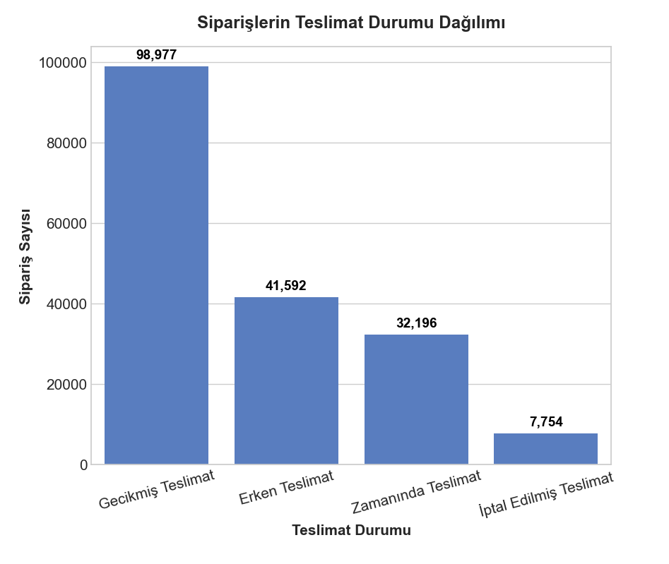
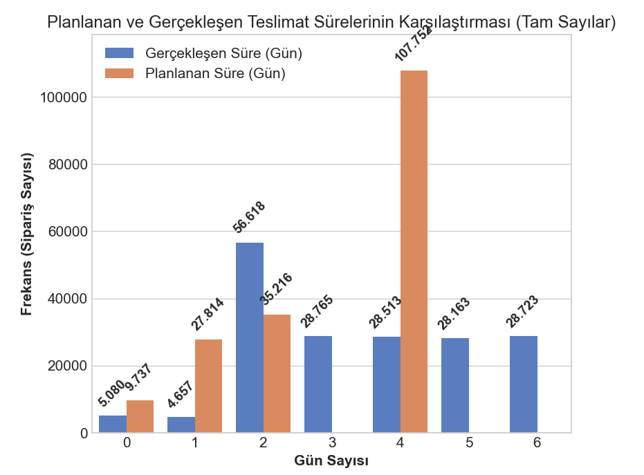
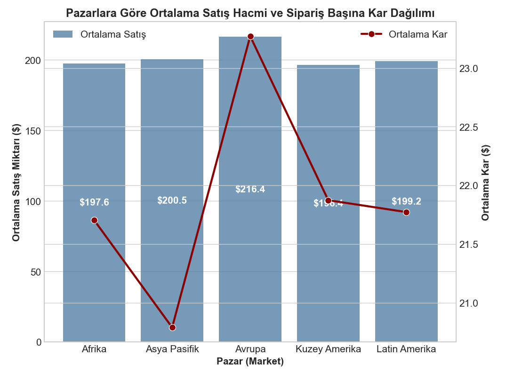
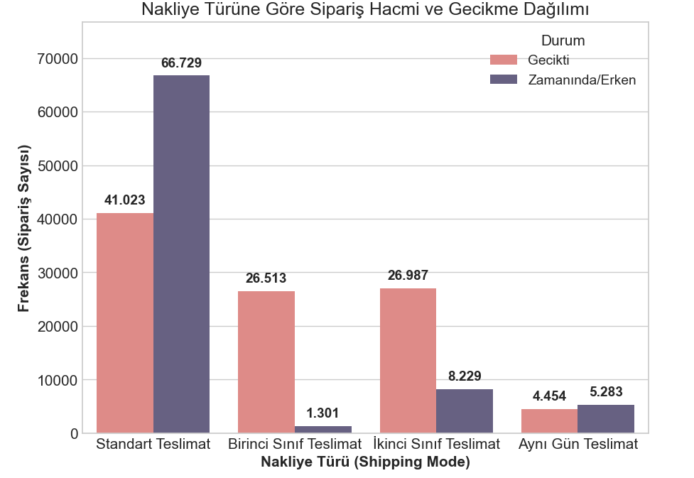
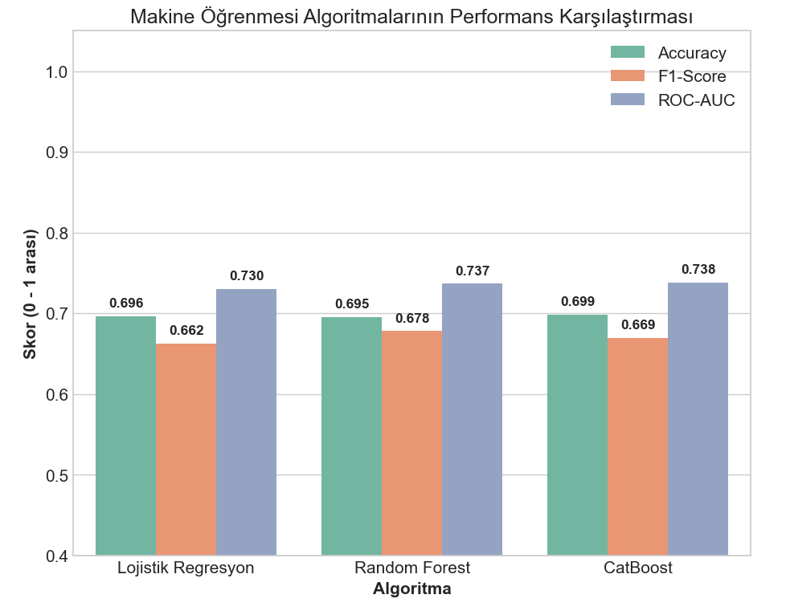
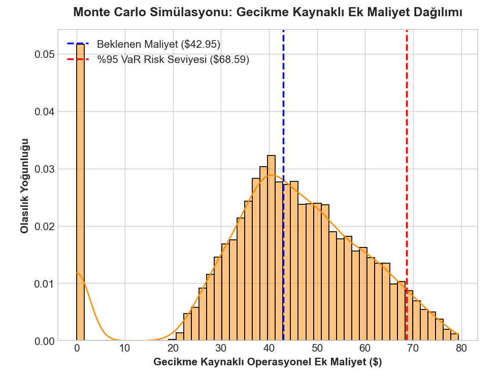
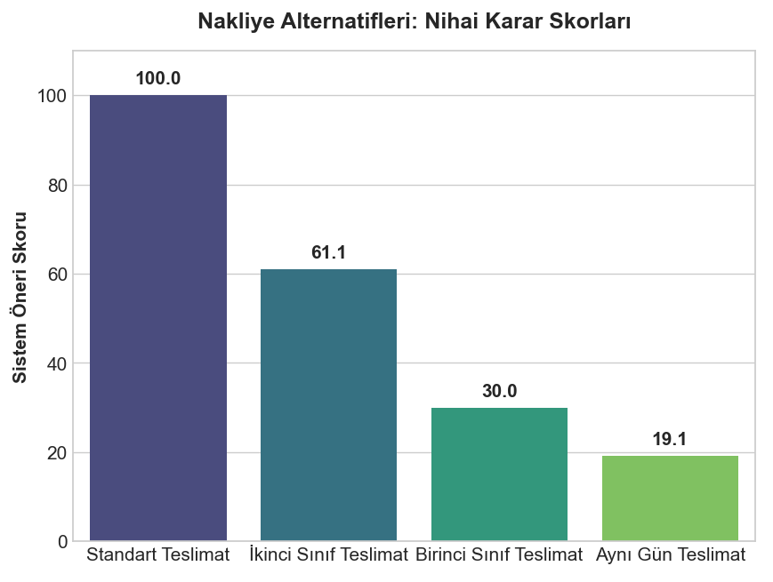
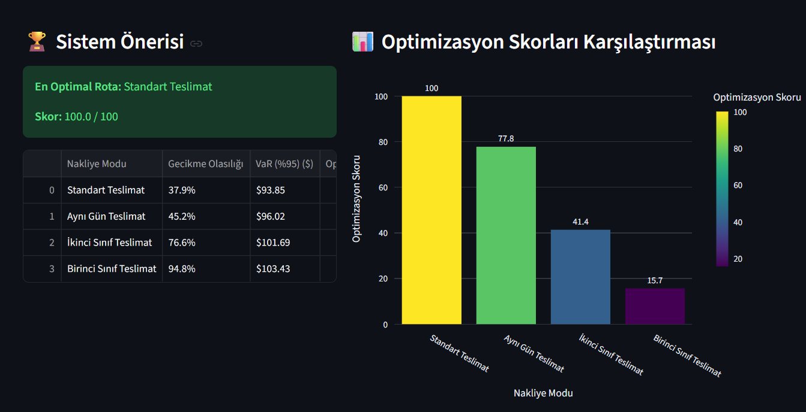

# Tedarik Zamanı Risk ve Maliyet Analizi: Makine Öğrenmesi Tabanlı KDS

Bu proje, tedarik zinciri operasyonlarındaki teslimat gecikmelerini ve buna bağlı asimetrik maliyetleri minimize etmek amacıyla geliştirilmiş Makine Öğrenmesi tabanlı bir Karar Destek Sistemidir (KDS). 

Projede geleneksel deterministik planlama yöntemlerinin yerine **CatBoost**, **Monte Carlo Simülasyonu** ve **Çok Kriterli Karar Verme (MCDM)** algoritmaları kullanılarak lojistik süreçler optimize edilmiştir.

---

## 📊 Proje Analiz Aşamaları ve Görsel Bulgular

### 1. Keşifçi Veri Analizi (EDA) & Verimsizliklerin Tespiti
Veri seti incelendiğinde, sistemdeki siparişlerin %54.8'inin geciktiği ve planlanan 4 günlük teslimat sürelerinin sahada büyük bir varyansla saptığı saptanmıştır. Ayrıca, en yüksek hacme sahip Asya Pasifik bölgesinin en düşük kâr marjına sahip olduğu ve premium hatların (First Class) %95.3 oranında kronik gecikme yaşadığı bulunmuştur.

  
  

  
  

### 2. Makine Öğrenmesi & Risk Simülasyonu
Gecikme olasılıklarını tahmin etmede en yüksek ayırt edici gücü (ROC-AUC: 0.738) gösteren **CatBoost** modeli seçilmiştir. Elde edilen olasılık çıktıları, 100.000 iterasyonluk **Monte Carlo Simülasyonuna** aktarılarak sipariş başına asimetrik risk maliyetleri ve %95 güven aralığında Riske Maruz Değer (VaR) hesaplanmıştır.

  
  

### 3. Çok Kriterli Karar Verme (MCDM) & Optimizasyon
Finansal risk, taşıma ücreti, gecikme olasılığı ve maksimum zarar kriterleri **SAW (Basit Toplamlı Ağırlıklandırma)** modeliyle optimize edilerek en güvenli ve maliyet-etkin nakliye modu dinamik olarak belirlenmektedir.

  
  

---

## 🚀 İnteraktif Dashboard Arayüzü (Streamlit)
Geliştirilen tüm matematiksel ve algoritmik altyapı, karar alıcıların senaryo analizi yapabileceği, risk bütçelerini yönetebileceği ve otomatik yönetici raporları türetebileceği etkileşimli bir web arayüzüne dönüştürülmüştür.

  

---

## 📂 Proje Dosya Yapısı
* `01_veri_kesfi_ve_gorsellestirme.py`: Veri temizleme ve temel teslimat durumlarının analizi.
* `02_nakliye_modu_analizi.py`: Farklı taşıma modlarının performans ve verimsizlik analizleri.
* `03_makine_ogrenmesi_modelleri.py`: Tahmin modellerinin eğitilmesi ve performans karşılaştırmaları.
* `04_mcdm_optimizasyonu.py`: Olasılık çıktılarının Çok Kriterli Karar Verme algoritmasına entegrasyonu.
* `05_entegre_kds_ve_monte_carlo.py`: VaR (Riske Maruz Değer) hesabı ve entegre sistem testi.
* `app.py`: Streamlit interaktif web uygulaması.
